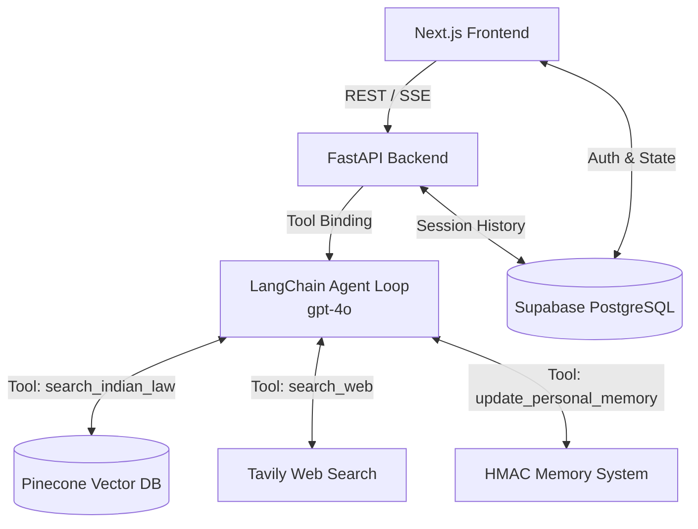
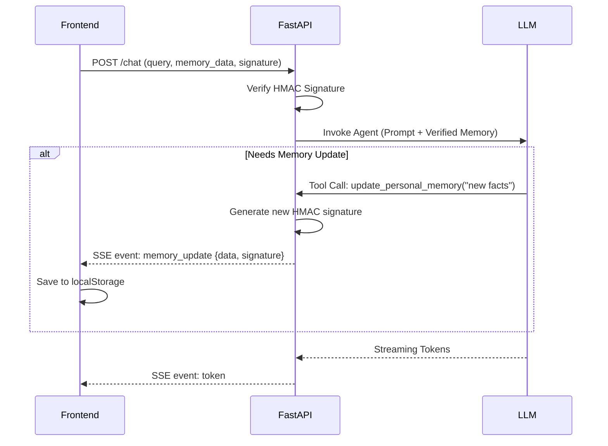

# LexIQ Architecture

This document details the internal architecture, data flow, and design patterns used in LexIQ. It is intended for developers joining the project to understand how the frontend and backend interact, how the agentic loop operates, and how memory is managed securely.

## High-Level System Architecture

## The Tool-Calling Agent Loop
LexIQ leverages an **agentic architecture** rather than a simple procedural RAG pipeline. 
When a user asks a question, the input is passed to an LLM (`gpt-4o`) equipped with specific tools:
1. `search_indian_law`: Queries the Pinecone vector database for specific Indian legal sections and clauses.
2. `search_web`: Uses the Tavily API to fetch general knowledge or off-topic legal data not in the vector DB.
3. `update_personal_memory`: Overwrites the user's personal facts in a secure client-side memory loop.

The agent evaluates the query and can make multiple iterative tool calls (up to 3 iterations) before formulating a final response. This allows the agent to self-correct (e.g., if a vector search yields no results, it can fallback to the web search tool).

## Server-Sent Events (SSE) Streaming
Because the agent can take time to execute multiple tool calls, LexIQ uses SSE to stream real-time updates and tokens back to the frontend.
The SSE pipeline yields different event types:
- `status`: Notifies the user of the agent's current action ("Searching legal database...").
- `token`: Streams the actual text response generation from the LLM.
- `metadata`: Sent at the end of the stream, containing the final answer, language, retrieved sources, and the route used.
- `memory_update`: Emitted when the agent decides to update the user's personal facts.
- `error`: Handles and relays exceptions smoothly.

## HMAC-Signed Client Memory System
To provide personalization without bloating the backend database with sensitive or ephemeral user facts, LexIQ uses a stateless, HMAC-signed `localStorage` memory system.

1. **Storage**: User facts are stored in the browser's `localStorage`.
2. **Transmission**: The frontend sends this memory along with a cryptographic signature (`signature`) in the `ChatRequest` payload.
3. **Verification**: The backend verifies the signature using `MEMORY_SECRET_KEY` in `security.py`. If it matches, the memory is injected into the LLM's system prompt.
4. **Updating**: If the LLM invokes the `update_personal_memory` tool, the backend generates a new signature for the updated memory string.
5. **Syncing**: The backend streams a `memory_update` SSE event to the client, which updates its `localStorage` with the new data and signature.

## RAG Pipeline (Vector DB + Retrieval)
The core legal knowledge is indexed in **Pinecone**.
- **Embeddings**: Documents are embedded (likely via OpenAI's `text-embedding-ada-002` or `text-embedding-3-small/large`).
- **Metadata Filtering**: When retrieving, the system can apply metadata filters (`act_filter`) based on regex matching of the user's command (e.g., matching "BNS" or "IPC" in the user query to isolate the search space).
- **Chunking & Storage**: Documents are chunked contextually and stored with metadata like `act`, `section_number`, and `section_title`.

## Supabase Hybrid Sync Flow
Supabase acts as the primary source of truth for:
1. **User Auth**: Standard JWT-based auth and Row Level Security (RLS) policies.
2. **Chat Sessions & History**: Storing the conversational threads (`chat_sessions` and `messages` tables). The backend interacts with these tables via the `backend.session` module to populate the LLM's short-term context window.
3. **User Profiles**: Managing roles (student, advocate, citizen).
4. **File Uploads**: Using Supabase Storage buckets (`user-uploads`).
