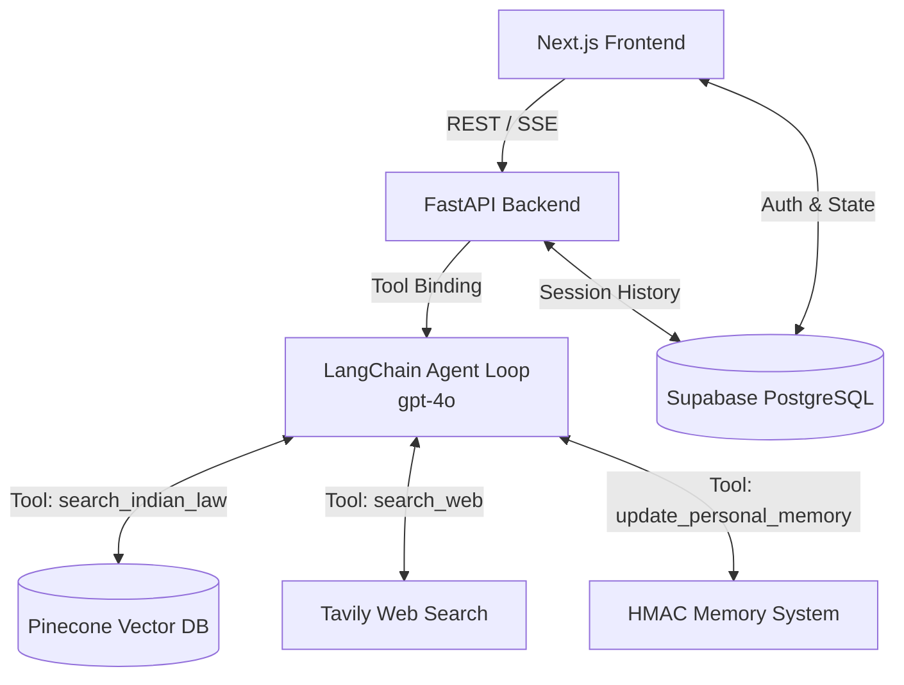
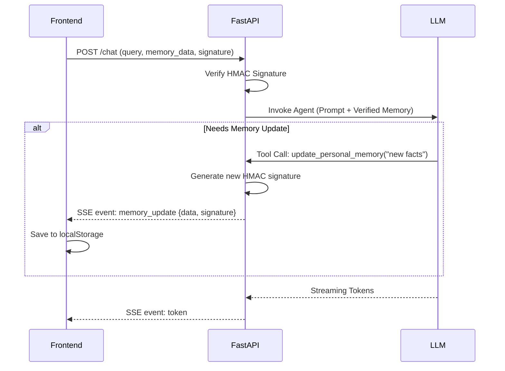

# LexIQ Architecture

This document outlines the core architecture and engineering design behind the LexIQ platform. LexIQ operates on a microservices-inspired paradigm, splitting high-performance UI rendering from compute-heavy AI operations.

## High-Level System Architecture

## The Tool-Calling Agent Loop
Unlike traditional Retrieval-Augmented Generation (RAG) pipelines that statically fetch data before calling the LLM, LexIQ utilizes an **Agentic Architecture**. 

Every user query is processed by a central LLM (`gpt-4o`) equipped with specific functions:
1. `search_indian_law`: Executes semantic searches against the Pinecone vector database.
2. `search_web`: Uses the Tavily API to fetch general knowledge or off-topic legal data.
3. `update_personal_memory`: Manages the user's localized persona data.

The engine evaluates queries iteratively. It can make multiple sequential tool calls (up to 3 iterations) to cross-reference data or fall back to alternative sources before synthesizing the final output.

## Server-Sent Events (SSE) Streaming
To maintain ultra-low latency during complex multi-tool executions, LexIQ relies on SSE for asynchronous real-time streaming.

The pipeline emits structured JSON events:
- `status`: Broadcasts the engine's current operation (e.g., "Searching legal database...").
- `token`: Streams the actual text response generation.
- `metadata`: Delivered at completion, encapsulating the final answer, detected language, retrieved sources, and routing paths.
- `memory_update`: Emitted asynchronously to sync the client-side memory payload.
- `error`: Handles exception propagation securely.

## Cryptographically Secured Client Memory
LexIQ introduces a stateless, HMAC-signed client memory layer. This allows the system to personalize responses (e.g., remembering a user is a law student) without storing ephemeral facts in the primary PostgreSQL database.

1. **Storage**: Facts reside in the browser's `localStorage`.
2. **Transmission**: The frontend attaches this data, alongside a cryptographic signature (`signature`), to the `ChatRequest` payload.
3. **Verification**: The FastAPI backend validates the HMAC SHA-256 signature using `MEMORY_SECRET_KEY`. Tampered data is strictly rejected.
4. **Updating**: When the engine invokes `update_personal_memory`, the backend recalculates the signature and streams the new payload back via SSE for the client to cache.

## Vector Search & Embedding Engine
The core legal knowledge base is hosted on **Pinecone**.
- **Embeddings**: Legal texts are chunked contextually and transformed into dense vectors.
- **Metadata Filtering**: The retrieval pipeline dynamically applies metadata filters (`act_filter`) by running regex matches on the user's command, narrowing the search space to specific acts (e.g., BNS, IPC) for higher precision.

## Identity & State Management
**Supabase (PostgreSQL)** serves as the primary system of record for the platform:
1. **Authentication**: JWT-based auth with strict Row Level Security (RLS) policies.
2. **Conversation History**: Threads are persisted in `chat_sessions` and `messages`. The backend hydrates the LLM's context window directly from these tables.
3. **Storage**: Secure file processing utilizing Supabase Storage buckets (`user-uploads`).
