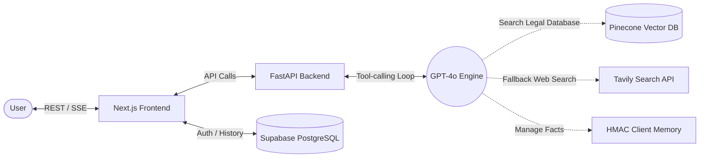

<div align="center">
  <h1>⚖️</h1>
  
  # LexIQ

  **The Advanced Indian Legal RAG Assistant**
  
  <p align="center">
    
    
    
    
    
    
    
    
  </p>
</div>

---

**LexIQ** is a state-of-the-art AI legal platform engineered to provide accurate, source-backed insights into Indian Law. Utilizing an advanced Agentic Retrieval-Augmented Generation (RAG) architecture, LexIQ serves as a specialized tool for navigating the Bharatiya Nyaya Sanhita (BNS), Criminal Procedure Code (CRPC), Indian Penal Code (IPC), and Income Tax Act & Rules.

## 🌟 Key Features

- **Agentic RAG Engine:** The LLM autonomously routes queries to vector databases or real-time web searches based on context.
- **Real-Time Streaming:** Server-Sent Events (SSE) deliver a seamless, low-latency conversational experience.
- **Secure Client Memory:** Cryptographically signed local memory persists user preferences without backend database overhead.
- **Multilingual Support:** Intelligent language detection and localized responses across Indian languages.
- **Source Citations:** Every legal response is strictly backed by accurate clause and section references.

## 🏗️ High-Level Architecture



## 🚀 Getting Started

### Prerequisites
- Node.js 18+ and Python 3.9+
- API Keys: OpenAI, Pinecone, Tavily, Supabase

### 1. Backend Initialization
The backend is powered by FastAPI and LangChain.

```bash
cd server
python -m venv venv
source venv/bin/activate  # On Windows: .\venv\Scripts\activate
pip install -r requirements.txt
```

Create a `.env` file in the `server` directory:
```env
OPENAI_API_KEY=your_openai_key
PINECONE_API_KEY=your_pinecone_key
TAVILY_API_KEY=your_tavily_key
SUPABASE_URL=your_supabase_url
SUPABASE_SERVICE_KEY=your_supabase_service_key
FRONTEND_URL=http://localhost:3000
MEMORY_SECRET_KEY=your_hmac_secret
```

Start the API server:
```bash
uvicorn main:app --reload --port 8000
```

### 2. Frontend Initialization
The frontend is built on Next.js App Router with Tailwind CSS.

```bash
cd client
npm install
cp .env.production.example .env.local
```

Update `.env.local` with your credentials:
```env
NEXT_PUBLIC_SUPABASE_URL=your_supabase_url
NEXT_PUBLIC_SUPABASE_ANON_KEY=your_supabase_anon_key
SUPABASE_SERVICE_KEY=your_supabase_service_key
FASTAPI_URL=http://localhost:8000
```

Start the development server:
```bash
npm run dev
```

Visit `http://localhost:3000` to access the LexIQ platform.

## 📚 Documentation
- **[System Architecture](ARCHITECTURE.md)** - Deep dive into the Agentic Loop, memory systems, and database schemas.
- **[API Reference](API.md)** - Documentation for REST and SSE endpoints.
- **[Deployment Guide](DEPLOYMENT.md)** - Production rollout and environment configuration details.
- **[Evaluation Report](eval/EVALUATION.md)** - Evaluation of the system.